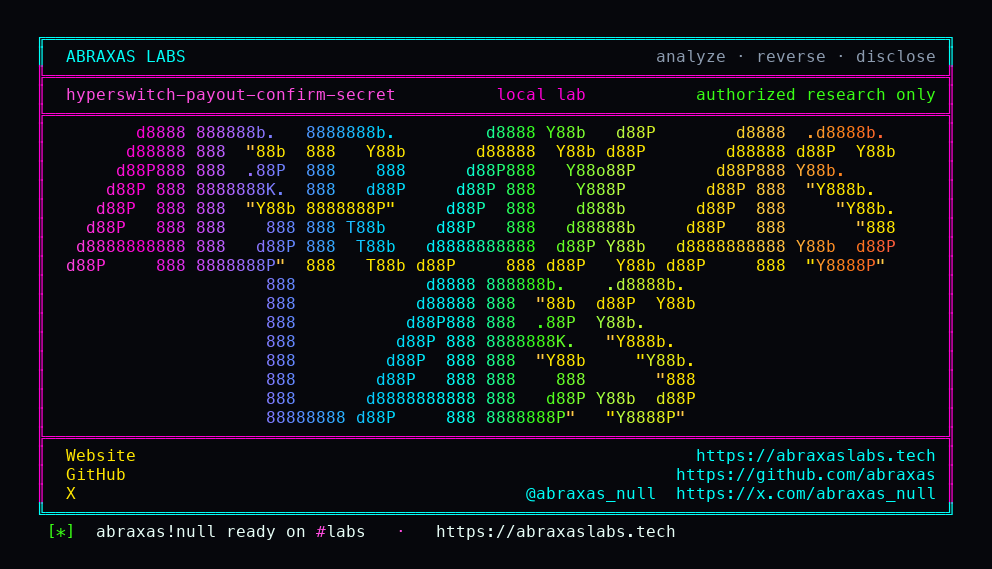

<p align="center">
  
</p>

<p align="center">
  <a href="https://abraxaslabs.tech"><strong>abraxaslabs.tech</strong></a>
  &nbsp;·&nbsp;
  <a href="https://github.com/abraxas">github.com/abraxas</a>
  &nbsp;·&nbsp;
  <a href="https://x.com/abraxas_null">@abraxas_null</a>
  &nbsp;·&nbsp;
  <a href="mailto:abraxas.null@proton.me">abraxas.null@proton.me</a>
  &nbsp;·&nbsp;
  <a href="https://github.com/abraxas/hyperswitch-payout-confirm-secret">hyperswitch-payout-confirm-secret</a>
</p>

# hyperswitch-payout-confirm-secret

**Hyperswitch** `2026.09.21.0` - Juspay

[`payouts_confirm`](https://github.com/juspay/hyperswitch/blob/2026.09.21.0/crates/router/src/routes/payouts.rs) authenticates `pk_` with [`check_value_present("client_secret")`](https://github.com/juspay/hyperswitch/blob/2026.09.21.0/crates/router/src/services/authentication.rs). Present. Not equal. Payments confirm still binds: [`authenticate_client_secret`](https://github.com/juspay/hyperswitch/blob/2026.09.21.0/crates/router/src/core/payments/helpers.rs) returns `IR_09` on mismatch. The confirm body is a full [`PayoutCreateRequest`](https://github.com/juspay/hyperswitch/blob/2026.09.21.0/crates/api_models/src/payouts.rs). [`update_payouts_and_payout_attempt`](https://github.com/juspay/hyperswitch/blob/2026.09.21.0/crates/router/src/core/payouts/helpers.rs) writes `amount` **before** connector routing.

**Dummy `client_secret` plus `amount=99900` on payouts confirm stores 99900. Payments confirm with the same dummy is still IR_09.**

| | |
|---|---|
| ID | no CVE yet |
| CWE | [CWE-863](https://cwe.mitre.org/data/definitions/863.html), [CWE-345](https://cwe.mitre.org/data/definitions/345.html) |
| CVSS | **High: 7.5** `CVSS:3.1/AV:N/AC:L/PR:N/UI:N/S:U/C:N/I:H/A:N` |
| Product | [Hyperswitch](https://github.com/juspay/hyperswitch) |
| Affected | through **2026.09.21.0** payouts confirm |
| Auth | publishable `pk_` plus payout id; dummy secret |
| License | [GNU Affero GPL v3.0](LICENSE) |
| Lab | `127.0.0.1` only |

## What an attacker can do

Need the publishable key (public, checkout) and the payout id (payout link, merchant dashboard, client create response). POST `/payouts/{id}/confirm` with a dummy secret and a new `amount`. Retrieve shows the raised amount even when connector routing returns **400 IR_39** (no eligible payout connector). The write already happened. Fulfillment on a shop that **has** a payout processor is the next step.

Guest without `pk_` is not this bug. Secret `sk_` confirm is merchant-side. Not a shell. Not a successful connector payout on this lab image.

Same product as the [unsigned Worldpayxml webhook](https://github.com/abraxas/hyperswitch-unsigned-webhook). Different bug.

## How I found it

I read `check_value_present`, then payments `req_cs != pi_cs`, then `update_payouts_and_payout_attempt` before `payouts_core`. Auth for `pk_` is "checkout SDK." The secret is supposed to bind the browser session to **this** payout. Payments does equality. Payouts does presence. A non-empty dummy is enough. The JSON is still a create request, so `amount` is not a no-op on confirm.

The first client that looks at this will send confirm without `client_secret` and get `MissingRequiredField`. Present. Send the real secret and you are the payer. Send a dummy on **payments** confirm and you get IR_09. That is the control. Send the dummy on **payouts** confirm.

Wrong turns already recorded: treating HTTP 400 IR_39 as "nothing happened" (retrieve the payout); amount stays 1000 because confirm omitted `amount` (`unwrap_or` keeps the old value); payout already terminal (`Success` / `Failed` / `Cancelled`); a reverse shell. Theatre. The witness is retrieve **amount=99900** after dummy secret, with payments confirm still IR_09.

Then: create a merchant, a secret key, a publishable `pk_`, a worldpayxml **payout** connector, and `POST /payouts/create` with `confirm=false` amount **1000**. RequiresConfirmation. Payments dummy-secret control. Payouts dummy 99900. Retrieve.

## Lab

```bash
cd lab
./run.sh
```

Target **only** `http://127.0.0.1:18083`. Do not share a compose project with the webhook lab.

```text
IOC amount_before=1000 status_before=requires_confirmation
IOC payments.confirm dummy-secret status=400 IR_09 client_secret mismatch
IOC payouts.confirm dummy-secret status=400 IR_39 no eligible connector
IOC retrieve amount=99900 status=requires_confirmation
SUCCESS Hyperswitch payout confirm unbound client_secret amount raise
```

## The fix

Compare `client_secret` to `payouts.client_secret` the way payments does, and do not apply `PayoutCreateRequest.amount` on confirm until that check passes. Dummy secret must be IR_09 (or 401), and retrieve amount must stay 1000.

## References

- [github.com/juspay/hyperswitch](https://github.com/juspay/hyperswitch) tag [2026.09.21.0](https://github.com/juspay/hyperswitch/releases/tag/2026.09.21.0)
- [`payouts.rs` routes](https://github.com/juspay/hyperswitch/blob/2026.09.21.0/crates/router/src/routes/payouts.rs) · [`authentication.rs`](https://github.com/juspay/hyperswitch/blob/2026.09.21.0/crates/router/src/services/authentication.rs) · [`payouts/helpers.rs`](https://github.com/juspay/hyperswitch/blob/2026.09.21.0/crates/router/src/core/payouts/helpers.rs) · [`core/payouts.rs`](https://github.com/juspay/hyperswitch/blob/2026.09.21.0/crates/router/src/core/payouts.rs) · [`payments/helpers.rs`](https://github.com/juspay/hyperswitch/blob/2026.09.21.0/crates/router/src/core/payments/helpers.rs)
- Same product: [hyperswitch-unsigned-webhook](https://github.com/abraxas/hyperswitch-unsigned-webhook)
- [CWE-863](https://cwe.mitre.org/data/definitions/863.html) · [CWE-345](https://cwe.mitre.org/data/definitions/345.html)

## License

GNU Affero GPL v3.0. See [LICENSE](LICENSE). Loopback lab only. No warranty.
